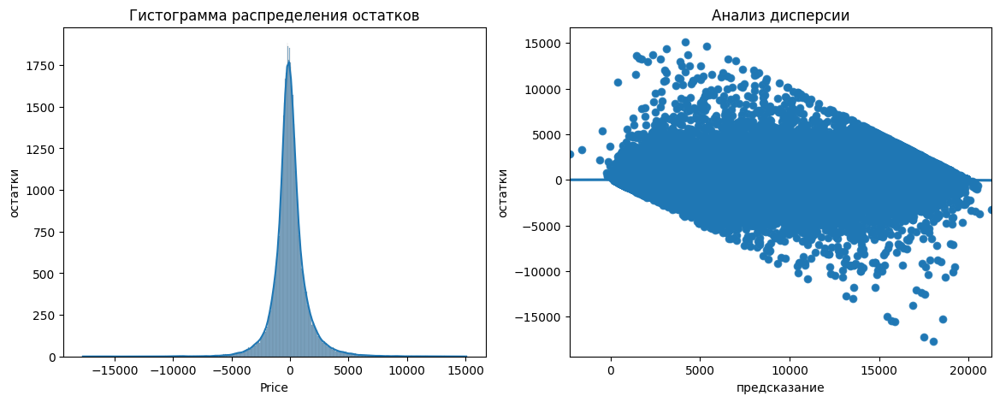
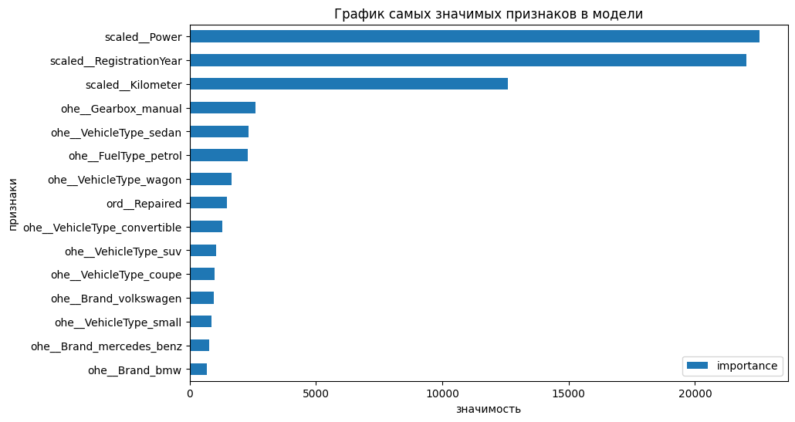

### <h2 style="font-size: 40px;">Прогноз цены автомобилей с пробегом</h2>

### Техническое задание

Разработать модель машинного обучения для определения рыночной стоимости подержанных автомобилей на основе их технических характеристик и комплектаций. Модель будет использоваться в мобильном или веб-приложении, помогающем пользователям оценить стоимость своего автомобиля.

1. Ключевые требования:
    - Точность предсказаний – модель должна максимально точно предсказывать рыночную цену.
    - Скорость обучения – время обучения модели не должно быть чрезмерно большим.
    - Скорость предсказания – модель должна быстро выдавать результат, чтобы обеспечить удобство пользователей.

2. Данные:
    - Входные данные включают информацию о характеристиках автомобилей и их исторические цены.

3. Цель:
    - Построить модель, оптимально балансирующую между точностью и производительностью для интеграции в сервис оценки автомобилей.

### Общий вывод работы

1. Предобработка данных:
   - Удалены дубликаты и некорректные значения (например, нулевые цены, аномальные значения мощности и года регистрации).
   - Пропуски в категориальных признаках заполнены наиболее часто встречающимися значениями.
   - Редкие категории признака `FuelType` были объединены в группу `other`.
2. Исследовательский анализ:
   - Выявлены наиболее значимые признаки, влияющие на цену: `RegistrationYear`, `Power`, `Kilometer` и `Model`.
   - Обнаружена мультиколлинеарность между некоторыми признаками (например, `Model` и `Brand`), что было учтено при выборе финальных признаков для модели.
3. Обучение моделей:
   - Были протестированы четыре модели: **LinearRegression**, **LGBMRegressor**, **CatBoostRegressor** и **XGBRegressor**.
   - Для оптимизации гиперпараметров использовался метод *OptunaSearchCV*, что позволило улучшить качество моделей.
   - Наилучшие результаты показала модель **LGBMRegressor** с метрикой *RMSE = 1493.32* и *R² = 0.896* на тестовых данных.
4. Выбор модели:
   - Модель **LGBMRegressor** была выбрана как оптимальная, так как она сочетает высокую точность и приемлемое время обучения, что соответствует требованиям заказчика.

  

    Рисунок 1: Распределение остатков модели. Видно отсутствие систематических ошибок.
  

  

    Рисунок 2: Наибольший вклад в предсказание цены вносят признаки: `Power`, `RegistrationYear`, `Kilometer`.
  

Для дальнейшего улучшения модели можно рассмотреть добавление новых признаков, таких как средняя цена по марке или модели. А также учет временных тенденций, например инфляции или сезонности спроса на автомобили. Для интеграции модели в приложение рекомендуется обеспечить её регулярное обновление на актуальных данных.